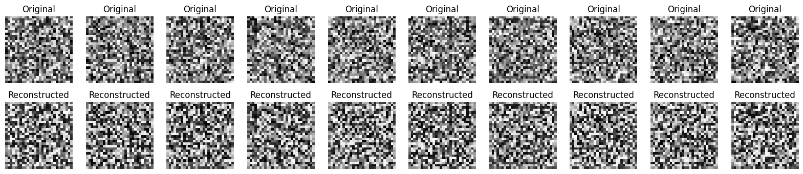

# Transpose Convolution with Keras

This project demonstrates how to use **transpose convolution (Conv2DTranspose)** in Keras to reconstruct or upsample data. The notebook focuses on understanding how neural networks can increase spatial resolution, which is commonly used in generative models and image reconstruction tasks.

---

##  Overview

The notebook builds a model that transforms a lower-dimensional representation into a higher-dimensional output using transpose convolution layers. This operation is often referred to as “deconvolution,” although it is technically different from true inverse convolution.

---

##  Core Idea

Transpose convolution is used to:

- increase spatial dimensions (upsampling)  
- reconstruct structured outputs  
- learn how to map compact representations back to full images  

Instead of reducing size like standard convolution, this operation expands the input.

---

##  Workflow

The notebook follows these steps:

1. Define input data or latent representation  
2. Apply transpose convolution layers  
3. Gradually increase spatial resolution  
4. Produce a structured output  

Each layer learns how to expand and refine the representation.



---

##  What is Transpose Convolution?

A standard convolution applies a filter over an input to reduce or transform it. Transpose convolution reverses this idea by spreading input values over a larger output space.

In simple terms:

- convolution → compresses information  
- transpose convolution → expands information  

---

##  Use Cases

- image generation (GANs)  
- autoencoders (decoder part)  
- super-resolution  
- segmentation models  

---

##  File Structure

```

Keras-transposeConvolution.ipynb   # main notebook
output.png                         # model output visualization
README.md                          # project documentation

```

---

##  Summary

This project provides a clear demonstration of how transpose convolution works in practice and how it can be used to reconstruct or generate higher-dimensional outputs from compact inputs.
```


